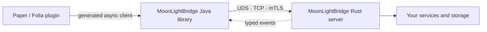

<div align="center">
  

  <p><strong>A fast, typed bridge between Minecraft plugins and Rust backends.</strong></p>
  <p>Keep Bukkit work on the server thread. Move expensive state, simulation and data processing to Rust.</p>

  [](https://github.com/MoonL1ghtProject/MoonLightBridge/releases)
  [](https://github.com/MoonL1ghtProject/MoonLightBridge/stargazers)
  [](https://openjdk.org/projects/jdk/21/)
  [](https://www.rust-lang.org/)
  [](https://github.com/MoonL1ghtProject/MoonLightBridge/actions/workflows/qodana.yml)
  [](#license)
</div>

MoonLightBridge is a library, not another server plugin. Add it to your Paper or Folia
plugin, describe the API once with Protocol Buffers, and call a Rust service through a
generated `CompletableFuture` client. TCP, mTLS and Unix-domain sockets use the same API.

## Why MoonLightBridge?

- **Typed end to end.** One `.proto` schema generates Java clients, Rust service traits,
  batch methods and server events.
- **Built for the hot path.** Multiplexed requests, a dedicated bounded writer, burst
  coalescing and reusable buffers keep the bridge overhead small.
- **Minecraft-aware.** Paper and Folia callbacks return through the correct scheduler;
  network I/O never has to block the tick thread.
- **Failure is explicit.** Deadlines, cancellation, heartbeat, reconnect supervision,
  backpressure, protocol validation and structured remote errors are part of the core.
- **Observable without plugin boilerplate.** Framework-owned Sentry errors and sampled
  traces are automatic; JFR remains available for local profiling.



## Install

MoonLightBridge `0.1.1` is published as small modules and as one convenient framework dependency.
Until the Maven Central namespace is verified, Java artifacts are available from GitHub Packages:

```kotlin
repositories {
    mavenCentral()
    maven {
        url = uri("https://maven.pkg.github.com/MoonL1ghtProject/MoonLightBridge")
        credentials {
            username = providers.gradleProperty("gpr.user").orNull
            password = providers.gradleProperty("gpr.key").orNull
        }
    }
}

dependencies {
    implementation("ru.moonlightproject:moonlight-bridge-framework:0.1.1")
}
```

MoonLightBridge is embedded into your plugin. If you build a shaded JAR, relocate its
dependencies and merge service descriptors:

```kotlin
tasks.shadowJar {
    mergeServiceFiles()
    relocate("com.google.protobuf", "your.plugin.internal.protobuf")
    relocate("io.sentry", "your.plugin.internal.sentry")
}
```

The same Java artifacts are mirrored to GitHub Packages by the release pipeline. Maven Central is recommended
for consumers because it needs no GitHub credentials; see
[the publishing guide](docs/publishing.md#github-packages) when you specifically want the
GitHub registry.

Add the Rust runtime to the backend:

```toml
[dependencies]
moonlight-bridge-server = "0.1.1"
tokio = { version = "1", features = ["macros", "rt-multi-thread"] }
```

Requirements are Java 21 or newer, Rust 1.88 or newer, and `protoc` for schema generation.

## Define an API once

```proto
syntax = "proto3";
package my.plugin.v1;

service ProfileService {
  rpc LoadProfile(LoadProfileRequest) returns (Profile);
}

message LoadProfileRequest { string player_id = 1; }
message Profile { string display_name = 1; int64 balance = 2; }
```

Apply the generator to the Java API module:

```kotlin
// settings.gradle.kts
pluginManagement {
    repositories {
        gradlePluginPortal()
        mavenCentral()
    }
}
```

```kotlin
// build.gradle.kts
plugins {
    id("ru.moonlightproject.bridge") version "0.1.1"
}

dependencies {
    implementation("ru.moonlightproject:moonlight-bridge-client:0.1.1")
    implementation("com.google.protobuf:protobuf-java:4.36.1")
}
```

The plugin reads `src/main/proto`, generates Protobuf messages and typed clients, then
checks `schema.lock` during `check`. The Rust side uses the same descriptor through
`moonlight-bridge-codegen`; details and the complete `build.rs` are in
[the code generation guide](docs/codegen.md).

## Call Rust from a plugin

```java
public final class ProfilesPlugin extends JavaPlugin {
    private MoonLightBridge bridge;
    private ProfileServiceClient profiles;

    @Override
    public void onEnable() {
        try {
            bridge = MoonLightBridge.start(this, "unix:/run/moonlightbridge/backend.sock");
            profiles = new ProfileServiceClient(bridge.channel());
        } catch (IOException error) {
            throw new IllegalStateException("Cannot start MoonLightBridge", error);
        }
    }

    public void showProfile(Player player) {
        var request = LoadProfileRequest.newBuilder()
            .setPlayerId(player.getUniqueId().toString())
            .build();

        bridge.call(profiles.loadProfile(request))
            .whenCompleteFor(player, (profile, error) -> {
                if (error != null) {
                    player.sendMessage("Backend unavailable: " + error.getMessage());
                    return;
                }
                player.sendMessage(profile.getDisplayName() + ": " + profile.getBalance());
            });
    }

    @Override
    public void onDisable() {
        if (bridge == null) return;
        try {
            bridge.close();
        } catch (IOException error) {
            getLogger().warning("MoonLightBridge shutdown failed: " + error.getMessage());
        }
    }
}
```

`whenCompleteFor` dispatches safely for the target entity. Global and region-aware
variants are available for work that is not tied to a player.

## Implement the backend

The generator creates the `ProfileService` trait and `register_profile_service` function:

```rust
use std::sync::Arc;
use moonlight_bridge_server::{HandlerError, Router, Server};
use my_plugin_api::{
    ProfileService, register_profile_service,
    model::{LoadProfileRequest, Profile},
};

struct Profiles;

impl ProfileService for Profiles {
    async fn load_profile(
        &self,
        request: LoadProfileRequest,
    ) -> Result<Profile, HandlerError> {
        Ok(Profile {
            display_name: request.player_id,
            balance: 1_000,
        })
    }
}

#[tokio::main]
async fn main() -> std::io::Result<()> {
    let router = register_profile_service(Router::builder(), Arc::new(Profiles)).build();
    Server::bind_tcp("127.0.0.1:38191", router).await?.run().await
}
```

For Pterodactyl, a shared Unix socket is the fastest same-host topology. Use mTLS when
the backend is in another container or on another machine. The supported layouts are
documented in [deployment-pterodactyl.md](docs/deployment-pterodactyl.md).

## What is included

| Area | Available in 0.1.1 |
|---|---|
| Transport | Unix socket, TCP, mutual TLS |
| RPC | Multiplexing, typed unary calls, typed batches, deadlines, cancellation |
| Load control | Bounded outgoing/in-flight queues, dedicated writer, write coalescing |
| Lifecycle | HELLO timeout, heartbeat, reconnect, health/readiness |
| Server push | Reconnect-safe typed Rust-to-Java events |
| Safety | Payload limits, method/response validation, duplicate-ID rejection |
| Minecraft | Paper/Folia scheduler-aware callbacks, no separate bridge plugin |
| Operations | Metrics, structured errors, Sentry traces/errors, JFR events |

## Documentation

- [Architecture and scope](docs/architecture.md)
- [Minecraft SDK](docs/minecraft-sdk.md)
- [Protocol reference](docs/protocol.md)
- [Schema and code generation](docs/codegen.md)
- [Performance and tuning](docs/performance.md)
- [Observability and privacy](docs/observability.md)
- [Pterodactyl deployment](docs/deployment-pterodactyl.md)
- [Security model](docs/security.md)
- [Development and verification](docs/development.md)
- [Publishing and releases](docs/publishing.md)
- [Changelog](CHANGELOG.md)

The repository contains a working [Paper plugin](examples/paper-test-plugin), its
[Rust backend](examples/test-plugin-backend), and a separate
[load-test plugin](examples/paper-load-test-plugin).

## Project status

Version `0.1.1` is a stable public API release. The transport and
lifecycle are fully tested, but the project is still young: benchmark your own workload
and pin exact versions in production. Backward-incompatible changes follow semantic
versioning.

## Contributing

Bug reports, focused pull requests and reproducible performance profiles are welcome.
Read [CONTRIBUTING.md](CONTRIBUTING.md) before sending a change. The full local check is:

```bash
./scripts/integration-test.sh
```

## License

Copyright © 2026 ~VicTim~ and MoonLightProject contributors.

MoonLightBridge is available under your choice of the
[MIT License](LICENSE-MIT) or [Apache License 2.0](LICENSE-APACHE).
